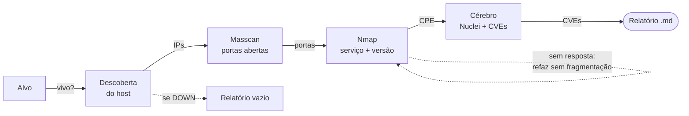

# 🐉 Draco-Workstation

Ferramenta de **auditoria de redes** que examina um computador, descobre por onde
ele "fala com o mundo", identifica falhas de segurança conhecidas e escreve um
**relatório claro** — tudo com **um único comando**.

É um *check-up de saúde* de um alvo na rede: descobre portas, identifica serviços
e versões, correlaciona CVEs e entrega um laudo pronto para o profissional
**defender** (saber o que corrigir) ou, em teste autorizado, **atacar de forma
ética**. O Draco apenas observa e cataloga — **não** invade nem explora nada.

> 📘 **Guia visual para iniciantes** (com o relatório real explicado passo a passo):
> este README cobre o mesmo conteúdo em texto.

---

## 🚀 Início rápido

```bash
draco                      # alvo padrão de testes (scanme.nmap.org)
draco scanme.nmap.org      # um site/domínio
draco 45.33.32.156         # um endereço IP
draco -f targets.txt       # vários alvos (um por linha)
```

É só isso. O `draco` descobre o host, varre as portas, identifica serviços e
versões, correlaciona CVEs e **gera o relatório sozinho**. O laudo sai em
`outputs/relatorio_draco_<IP>_<DATA>.md`.

> 🔑 **Root é obrigatório.** A varredura sênior (SYN furtivo, masscan, OS
> fingerprint, evasão) depende de *raw sockets*. O comando `draco` **se eleva
> sozinho** e pede a senha do seu computador **uma vez**. Sem root, ele não roda.

---

## 💡 A ideia, com uma analogia

Cada computador na internet é uma **casa**. A casa tem **portas** (a 80 é a do
site, a 22 a do acesso remoto); atrás de cada porta aberta mora um **serviço** (um
programa), e programas têm **versões** — versões antigas costumam ter **falhas
conhecidas**. O Draco é o **inspetor** que anota as portas abertas, pergunta "quem
mora aqui e qual a idade?" e consulta um **catálogo público de falhas** para
avisar o que é perigoso.

---

## 📖 Conceitos essenciais (7 palavras que abrem tudo)

| Termo | O que é | Analogia |
|---|---|---|
| **IP** (`45.33.32.156`) | O endereço do computador na internet. | O CEP + número da casa. |
| **Porta** (`22`, `80`…) | Um canal de entrada numerado (existem 65.535). | As portas e janelas da casa. |
| **Estado** (aberta/fechada/filtrada) | Aberta = alguém atende; fechada = "não tem ninguém"; filtrada = firewall engoliu a batida. | Destrancada · trancada · muro que nem deixa bater. |
| **Serviço & Versão** (`OpenSSH 6.6.1`) | O programa que atende e sua versão exata. | O modelo e o ano do carro (decide o recall). |
| **Vulnerabilidade** | Um defeito de segurança que pode ser abusado. | Uma fechadura com defeito de fábrica. |
| **CVE** (`CVE-2016-1908`) | O número de identidade mundial de uma falha. | O número do recall daquele defeito. |
| **CVSS** (`0.0`–`10.0`) | A nota de gravidade (9–10 crítico; 7–8.9 alto; 4–6.9 médio). | A nota de risco do recall. |

---

## 🛠️ O time de ferramentas

O Draco é o **maestro**: ele não reinventa a roda, orquestra quatro ferramentas
famosas e junta tudo num relatório só.

| Ferramenta | Papel | Analogia |
|---|---|---|
| **Masscan** | Batedor veloz: acha **quais portas estão abertas** em segundos. | Passa correndo e anota as janelas acesas. |
| **Nmap** | Investigador: vai **só nas portas abertas** e descobre serviço, versão e SO (com técnicas furtivas). | Conversa em cada janela acesa. |
| **Nuclei** | Auditor de sites: se houver web (80/443), roda milhares de testes prontos. | Um checklist gigante de defeitos comuns. |
| **SearchSploit** | Arquivo de falhas **offline** (Exploit-DB local). | O fichário de recalls na oficina. |
| **O "Cérebro"** | A lógica que **reage** aos achados e consulta o **NVD** (catálogo oficial de CVEs). | O inspetor-chefe que decide o próximo passo. |

---

## 🔀 O fluxo (o que um comando faz por baixo)

Cada etapa usa a saída da anterior — do mais leve ao mais profundo:



As setas tracejadas são as **decisões de segurança** do Cérebro: se o host está
**DOWN**, encerra e gera relatório vazio (não trava); se o Nmap furtivo **não
recebe resposta** (comum em redes que descartam pacotes fragmentados, como WSL2),
ele **refaz automaticamente sem fragmentação** — um *fallback de confiabilidade*.

---

## ⚙️ Instalação

Testado em Ubuntu/Debian (inclusive WSL2). Um comando prepara tudo:

```bash
./setup_environment.sh     # binários + venv + registra o comando 'draco'
```

Instala `nmap`, `masscan`, `nuclei`, `searchsploit` (base do Exploit-DB via git,
já que o pacote `exploitdb` saiu dos repositórios recentes do Ubuntu) e cria o
comando global `draco`. A ferramenta **degrada com log claro** se algum binário
faltar (ex.: sem `masscan`, usa `nmap` para descobrir portas).

---

## ▶️ Como usar

```bash
draco                      # alvo padrão scanme.nmap.org
draco scanme.nmap.org      # um alvo
draco -f targets.txt       # arquivo de alvos
```

**Passo a passo:**

1. **Digite o comando** (uma das formas acima). Sem argumento → usa `scanme.nmap.org`.
2. **Digite a senha uma vez** — o Draco exige root e se eleva sozinho.
3. **Acompanhe os logs** `[DRACO-ENGINE]` na tela (cada passo em tempo real).
4. **Abra o relatório** em `outputs/relatorio_draco_<IP>_<DATA>.md`.

**Opções (todas opcionais):** `-f/--file <arquivo>`, `-o/--output-dir <dir>`,
`-c/--config <arquivo>`, `--no-online` (só offline), `--log-level`.

> **Autorização:** o alvo que você digita é auditado direto — sem listas de
> permitidos, sem burocracia. A responsabilidade é sua: **só aponte o Draco para
> alvos que você tem permissão de testar.**

---

## 📄 Como ler o relatório (o mais importante)

Exemplo **real** gerado contra `scanme.nmap.org`. As quatro seções, em ordem:

### 1. Status Geral do Host

| IP | Status | Sistema Operacional | Tempo | Método |
|---|---|---|---|---|
| 45.33.32.156 | 🟢 UP | Linux 5.0 – 5.5 | 189ms | ICMP / TCP-connect:80 |

A casa está de pé (**UP**), é um Linux, respondeu rápido, confirmado por dois
métodos. Se estivesse **DOWN**, seria a única tabela preenchida — e tudo bem.

### 2. Mapeamento de Portas

| Porta | Estado | Razão | Serviço | Versão |
|---|---|---|---|---|
| 22 | 🟢 Aberta | `syn-ack` | SSH | OpenSSH 6.6.1p1 |
| 80 | 🟢 Aberta | `syn-ack` | HTTP | Apache httpd 2.4.7 |

Duas portas abertas. A coluna **Razão** é o detalhe de ouro: `syn-ack` = "o
servidor respondeu que a porta está aberta". Você também veria `reset` (fechada)
ou `no-response` (firewall). São versões antigas — é o que a próxima seção explora.

### 3. Vulnerabilidades e CVEs *(60 correlacionadas neste exemplo)*

| Porta / Serviço | CVE | Severidade | Fonte | O que é |
|---|---|---|---|---|
| 80 · Apache 2.4.7 | CVE-2017-7679 | 🔴 Crítica (9.8) | nvd | Leitura além do buffer no mod_mime. |
| 22 · OpenSSH 6.6.1 | CVE-2016-1908 | 🔴 Crítica (9.8) | nvd | Encaminhamento X11 vira acesso confiável. |
| 22 · OpenSSH 6.6.1 | CVE-2015-5600 | 🟠 Alta (8.1) | nvd | Facilita força bruta / negação de serviço. |
| 22 · OpenSSH 6.6.1 | CVE-2018-15473 | 🟡 Média (5.3) | nvd | Permite descobrir usuários válidos. |

Cada linha é uma falha conhecida. Leia: *"a porta 80 (Apache 2.4.7) tem a falha
CVE-2017-7679, nota 9.8 — crítica"*. A coluna **Fonte** diz de onde veio (`nvd` =
catálogo oficial, `searchsploit` = base local, `nuclei` = teste no site). Comece
**sempre de cima**: as críticas são as de ação imediata. A tabela vem ordenada da
mais grave para a menos.

### 4. Vetores Recomendados

Próximos passos sugeridos, sempre em nível de **recomendação** (nunca código de
ataque pronto): ex.: *"Enumeração web na porta 80"*, *"Auditoria SSH / enumeração
de usuários (CVE-2018-15473)"*. Um apêndice lista **todos os comandos executados**,
para você auditar exatamente o que a ferramenta fez.

---

## 🛡️⚔️ E com o laudo na mão?

- **Se você defende:** comece pelas críticas/altas. Para cada uma: **atualize** o
  programa, feche a porta se não precisa estar aberta, coloque firewall. O CVSS dá
  a ordem de prioridade.
- **Se você ataca (autorizado):** em pentest **com permissão por escrito**, o
  relatório é o mapa — os CVEs e vetores mostram por onde provar que a falha é
  real, sempre dentro do escopo.

> **A linha que não se cruza:** escanear sem autorização é ilegal na maioria dos
> países. Use no seu ambiente, em laboratórios, ou no `scanme.nmap.org` (feito
> para isso). Permissão primeiro, sempre.

---

## 🔎 Descoberta de portas: Masscan **ou** Nmap?

Boa pergunta de engenharia. O masscan **não é "pior" que o nmap** — ele tem outro
papel: é um **localizador de portas** ultrarrápido. A profundidade (versão, SO,
scripts) vem do **nmap** logo depois, só nas portas que o masscan achou. Esse
encadeamento *masscan → nmap* é o **padrão profissional**, feito para velocidade.

Quando cada um vence:

| Cenário | Melhor escolha | Por quê |
|---|---|---|
| **Poucos alvos, máxima precisão** | **Nmap sozinho** | O nmap retransmite e adapta o timing; erra menos "falso-fechado". |
| **Muitos alvos / faixas grandes** | **Masscan → Nmap** | O masscan varre 65.535 portas em segundos; o nmap ficaria horas. |
| **Rede que perde pacotes** | **Nmap sozinho** | Em taxas altas o masscan pode *perder* portas (falso-negativo). |

Como você prioriza **força e resultado** sobre velocidade, para poucos alvos vale
usar **só o nmap**. É um toque no `config/draco.yaml`:

```yaml
masscan:
  enabled: false     # pula o masscan; o nmap faz a descoberta E o detalhamento
```

Com isso, o nmap varre todas as portas diretamente (mais lento, porém mais
confiável). O padrão de fábrica mantém o masscan (rápido) + o *fallback* de
confiabilidade que já corrige o caso de fragmentação descartada.

---

## 🥷 Técnicas avançadas de Nmap

Tudo em `config/draco.yaml` (seção `nmap`). Evasão: fragmentação (`-f`), padding
(`--data-length`), **decoys** (`-D`), **MTU** (`--mtu`), **source-port** (`-g`),
**spoof-mac**; timing `-T0..T5` (T2/T1 para alvos sensíveis). Profundidade: `-sV`,
`-O`, `-A`. **NSE** (`nse_scripts: [vulners, http-enum, "smb-vuln*"]`) — e a saída
é **parseada** para o relatório (CVE+CVSS do `vulners`, `smb-vuln*` como crítico,
diretórios do `http-enum`).

Scanners alternativos (RustScan, Naabu, Nikto, ZMap) ainda **não** estão
integrados — peça se quiser algum como backend selecionável.

---

## 🧪 Testes e lint

Não tocam a rede nem executam binários reais (usam saídas capturadas em `tests/fixtures/`):

```bash
./venv/bin/pytest -q          # 54 testes
./venv/bin/ruff check .       # lint
```

---

## 📁 O que é cada arquivo (você não precisa mexer em nada disso)

Você só usa o comando `draco`. Opcionalmente edita `config/draco.yaml`. O resto é
o motor interno (modular de propósito, para uma futura GUI/API):

| Caminho | Papel |
|---|---|
| `draco.sh` | O lançador (o comando `draco` aponta para cá; eleva a root). |
| `config/draco.yaml` | Ajustes opcionais (portas, timing, técnicas avançadas). |
| `outputs/` | Onde os relatórios `.md` são salvos. |
| `draco/cli.py` · `engine.py` | Entrada e o "maestro" do pipeline. |
| `draco/ingest.py` · `discovery.py` | Lê/valida alvos · host UP/DOWN. |
| `draco/scanner.py` · `parser.py` | masscan+nmap · lê as saídas → dados. |
| `draco/brain.py` · `correlation.py` | Decide os próximos passos · CVEs. |
| `draco/reporter.py` | Gera o relatório `.md`. |
| `draco/config.py` · `logging_engine.py` · `runner.py` · `models.py` | Infra: config, logs, subprocessos seguros, estruturas de dados. |

---

## ⚖️ Aviso legal

Ferramenta para **auditoria autorizada, pesquisa de segurança e uso defensivo**.
O uso contra sistemas sem autorização é ilegal. Você é responsável por respeitar
o escopo acordado e a legislação aplicável.
